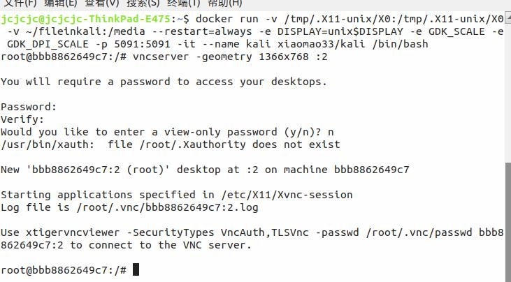
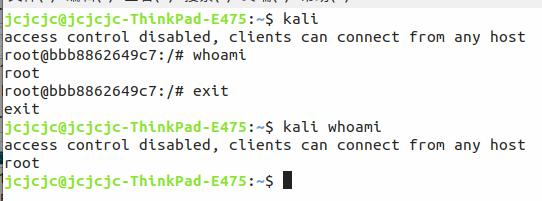
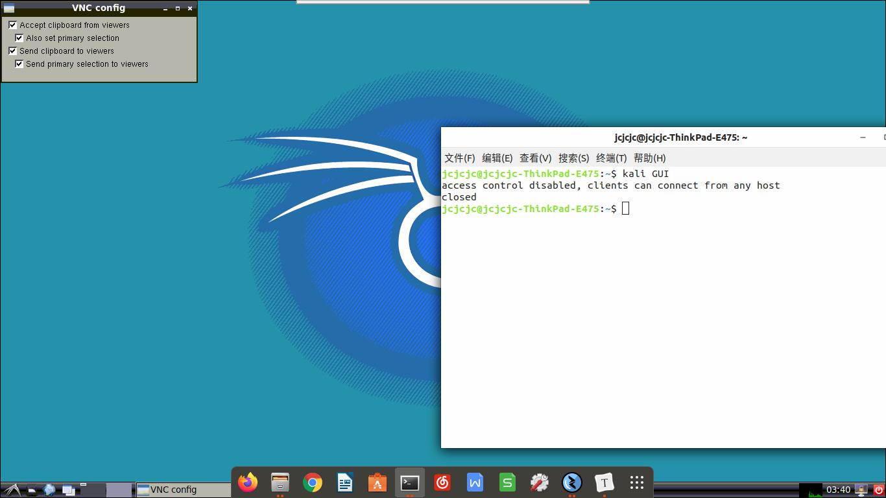
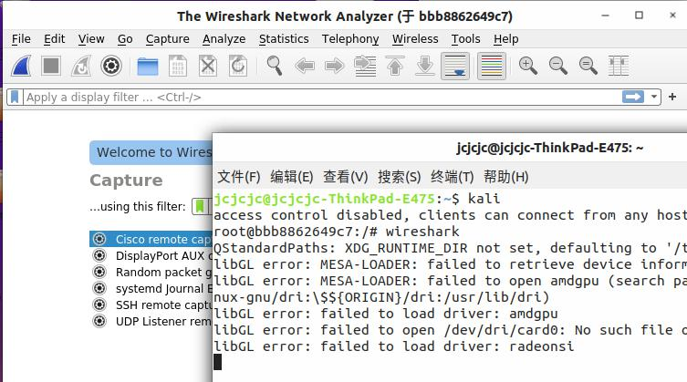
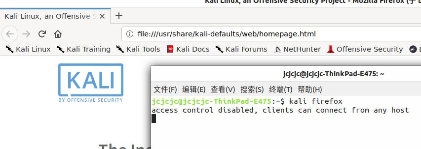

# Desktop-Kali by Docker

###### by:小帽

### init：

```sh
git clone https://github.com/yikongge/DesktopKaliByDocker.git
cd DesktopKaliByDocker
docker build -t kali ./file/
chmod +x kali.sh
sudo ln -s `pwd`/kali.sh /usr/bin/kali
ln -s `pwd`/kali.remmina ~/.kali.remmina


docker run -v /tmp/.X11-unix:/tmp/.X11-unix -v ~/fileinkali:/media --restart=always -e DISPLAY=unix$DISPLAY -e GDK_SCALE -e GDK_DPI_SCALE -p 5902:5902 -it --name kali kali /bin/bash

#第一次运行请在容器中执行 vncserver -geometry 1366x768 :2  设置默认密码

sudo cp kali.desktop /usr/share/applications
sudo cp kali.svg /usr/share/icons/
```



### use:

#共四种使用模式：

```sh
kali			#进入shell交互

kali command 		#执行命令

kali GUI 		#vnc链接界面

dock中点击图标   #vnc链接界面
```





在命令中执行带界面应用会直接宿主机打开





另：  ~/fileinkali文件夹映射在容器/media下


https://www.jianshu.com/p/e40739045c51

